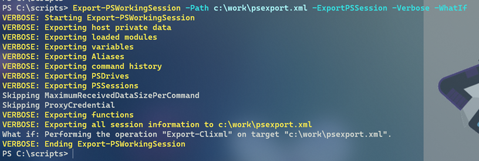
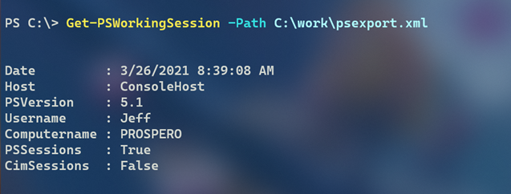
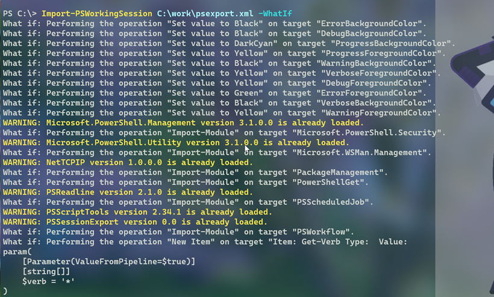

# PSSessionExport

This is a demonstration module created in response to an Iron Scripter PowerShell [Challenge](https://ironscripter.us/a-powershell-session-challenge-2/). The goal is to export as much of a PowerShell working console session to a file and then import the saved data in a new PowerShell console session. It is unlikely to reach 100% compatibility, but this module tries to get as close as possible.

It is assumed you will be exporting and importing into the same PowerShell major version, i.e 5 or 7. If you attempt to import across versions, you will get an error.

## Export

You can export the current session to an XML file. You will have to specify if you want to include exporting existing PSSessions and/or CimSessions.

In a new PowerShell session, you can get information about the export.

The module includes functions to import individual items such as Aliases or PSDrives, but it is expected you will import the entire session.

Additional background information on this module can be found at <https://jdhitsolutions.com/blog/powershell/8252/answering-the-powershell-export-challenge/>.

## To Do

The project isn't 100% complete. These items should be addressed:

- PSReadline Options and keyhandlers
- CIMSession Options
- PowerShell 7 Experimental Features
- Export custom format data. This should be added from module imports. But there may be stand-alone formats.
- Export custom type. Maybe use the [PSTypeExtensionTools](https://github.com/jdhitsolutions/PSTypeExtensionTools) module and let the user specify what type extensions to export. Anything that was extended by a module should be already be taken care of.
- Help documentation
